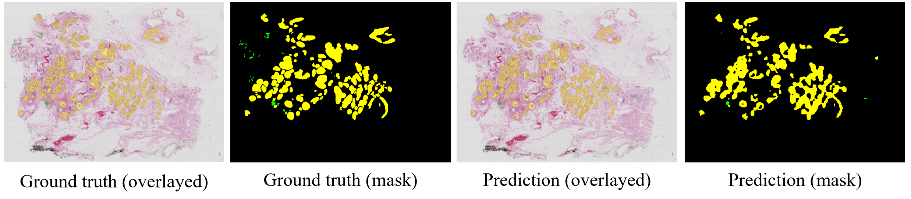

# Graph V-Net
We provide Pytorch implementations for our paper "[A Hierarchical Graph V-Net with Semi-supervised Pre-training for Breast Cancer Histology Image Classification](https://ieeexplore.ieee.org/document/10255661)" (IEEE TMI).

## 1. Introduction
Graph V-Net is a hierarchical graph convolutional network for patch-based breast cancer diagnosis. 
The proposed Graph V-Net classifies each patch within the whole slide image into four categories: normal, benign, carcinoma in situ, and invasive carcinoma. 

<p align="center">
     <br />
    <em>
    Figure 1. An overview of the proposed Graph V-Net.
    </em>
</p>

**Preview:**

Our proposed framework consists of two main components: 

- Pre-train the patch-level feature extractor with semi-supervised learning.

- Fine-tune the Graph V-Net in a supervised learning manner.

## 2. Graph V-Net Walkthrough
  
- ### Dataset Preparation

  Download the [BACH](https://zenodo.org/record/3632035) dataset, which includes the BACH training set (ICIAR2018_BACH_Challenge.zip) and testing set (ICIAR2018_BACH_Challenge_TestDataset.zip). Unzip them in the `./dataset/` folder.
  Note that the BACH dataset includes both microscopy images (ROI) and whole slide images, and we use whole slide images only. The folder structure should be like this:
  ```
  /dataset/
     ├── annotations
     ├── ICIAR2018_BACH_Challenge
     ├── ICIAR2018_BACH_Challenge_TestDataset
  ```
  We provide refined annotations (by pathologists from Yunnan Cancer Hospital) for the BACH dataset in `./dataset/annotations/`. 
  <p align="center">
     <br />
    <em>
    Figure 2. (a) The original annotation provided by BACH organizers. (b) A WSI relabeled by the pathologists from Yunnan Cancer Hospital. 
    </em>
</p>

- ### Date Preprocessing
  (1) Unzip all the data, and create a conda environment for preprocessing. 
  ```bash
  conda create --name openslide python=3.8
  conda activate openslide
  conda install pytorch==1.12.1 torchvision==0.13.1 cudatoolkit=11.3 -c pytorch
  conda install -c conda-forge openslide
  conda install -c conda-forge openslide-python
  pip install -r ./requirements.txt
  ```
  (2) Run `./preprocessing/preprocessing_pretrain.py` first. This script will generate non-overlapping patches (from 31 labeled WSIs and 9 unlabeled WSIs) for pre-training in `./dataset/pretrain/`.  The file name of a specific patch indicates its spatial location and the class (0, 1, 2, or 3). For instance, `./labeled/01/18_58_3/.png` indicates that the patch locates at the 18th row and 58th column of the WSI, and its class is 3 (invasive carcinoma).  
  (3) Then, run `./preprocessing/preprocessing_finetune.py` to generate overlapping regions (from 31 labeled WSIs) for fine-tuning and testing in `./dataset/finetune/`. Each cropped region consists of 64 patches and the corresponding soft label is a numpy array with a size of (8,8,4), which indicates the average label of all pixels in those 8*8 patches within the region.

- ### Pre-training
  (1) Create another conda environment (without Openslide package) for pre-training, fine-tuning, and testing. You can install all the dependencies by
  ```bash
  conda create --name vnet python=3.8
  conda activate vnet
  conda install pytorch==1.12.1 torchvision==0.13.1 torchaudio==0.12.1 cudatoolkit=11.3 -c pytorch
  pip install -r ./requirements.txt
  ```
  (2) To pre-train the patch encoder, run `./pretrain/pretrain.py`. The weights of the patch encoder will be saved in `./weight/pretrain/`. Run `./pretrain/visualize_attention.py` to visualize the attention maps of the patch encoder.
  We have provided the pre-trained weight on BACH dataset in `./weight/checkpoint.pth` using `--train_samples` (in `./pretrain/pretrain.py`. ) and all the unlabeled WSIs. 
  <p align="center">
       <br />
      <em>
      Figure 3. The attention maps of the last self-attention layer from the patch encoder.
      </em>
  </p>

- ### Fine-tuning

   To fine-tune our framework, run `./train.py`. When fine-tuning is completed, the weights will be saved in `./weight/finetune/`. 

- ### Testing
  
  Run `test.py`, and the results (figure 3) will be saved in `./snapshot/test/`.

  <p align="center">
       <br />
      <em>
      Figure 3. The prediction results of our framework.
      </em>
  </p>

## 3. Citation
```bibtex
    @ARTICLE{10255661,
      author={Li, Yonghao and Shen, Yiqing and Zhang, Jiadong and Song, Shujie and Li, Zhenhui and Ke, Jing and Shen, Dinggang},
      journal={IEEE Transactions on Medical Imaging}, 
      title={A Hierarchical Graph V-Net with Semi-supervised Pre-training for Histological Image based Breast Cancer Classification}, 
      year={2023},
      volume={},
      number={},
      pages={1-1},
      doi={10.1109/TMI.2023.3317132}}
```

## 4. ToDo

- Upload our annotations for the BACH dataset.
- Upload the pre-trained weight of the patch encoder on our in-house dataset (from Yunnan Cancer Hospital).

## 5. References
- ICIAR2018_BACH_Challenge: [[HERE]](https://www.sciencedirect.com/science/article/abs/pii/S1361841518307941)

- DINO: [[HERE]](https://github.com/facebookresearch/dino)

- Vision GNN: [[HERE]](https://github.com/huawei-noah/Efficient-AI-Backbones/tree/master/vig_pytorch)

- python-wsi-preprocessing: [[HERE]](https://github.com/deroneriksson/python-wsi-preprocessing)
